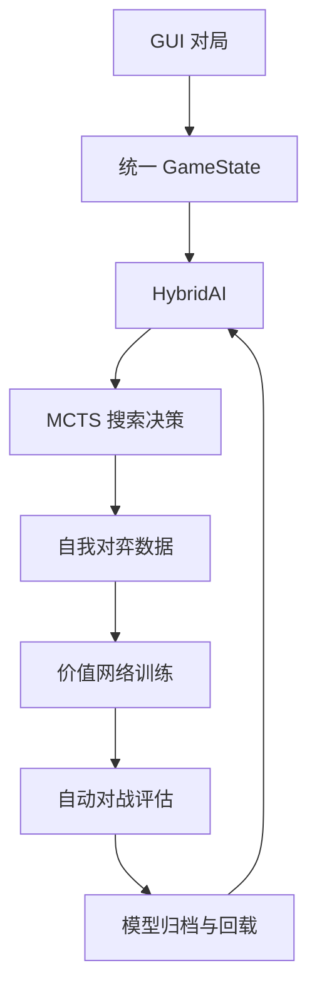

[README.md](https://github.com/user-attachments/files/30734409/README.md)
# 爱因斯坦棋智能博弈系统

> 一个面向 5×5 爱因斯坦棋的单机人机博弈与 AI 训练平台，集完整规则、图形化交互、棋谱记录、混合智能决策、自我对弈、价值网络训练和自动评估于一体。

## 项目简介

本项目以 5×5 爱因斯坦棋为研究对象，目标是实现一套兼具规则完整性、图形化交互和持续训练能力的人机博弈程序。用户既可以通过图形界面进行双人对战或挑战 AI，也可以在命令行中生成自我对弈数据、训练价值网络，并通过自动对战检验新模型是否真正得到提升。

爱因斯坦棋同时包含骰子的随机性与走子的策略性。红、蓝双方各有编号 1 至 6 的六枚棋子：红方由左上角向右下角推进，蓝方由右下角向左上角推进。每回合掷骰后，骰子点数决定可以行动的棋子；若对应编号的棋子已经被吃，则改选编号距离该点数最近的存活棋子。任一方率先抵达对方目标角，或吃光对方全部棋子，即取得胜利。

当前系统已经形成以下完整闭环：



该闭环使系统具备持续优化的基础，但训练轮数并不等同于模型水平。模型质量仍取决于自我对弈规模、局面多样性、探索强度、训练收敛情况以及候选模型与旧模型的实际对战结果。

## 核心功能

- 完整实现爱因斯坦棋的开局、掷骰、选子、移动、吃子、跳过回合和胜负判定规则。
- 支持玩家对玩家、玩家对 AI、自由行走等多种模式。
- 支持玩家执红或执蓝、随机或指定棋子摆放、随机先手和手动先手设置。
- 提供合法位置高亮、状态提示、悔棋和胜负提示。
- 自动记录开局、骰子、走子、吃子、跳过回合和最终胜者，并支持复制棋谱。
- 提供启发式、MLP、GNN 和 Ensemble 多种局面评估方式。
- 使用蒙特卡洛树搜索在随机骰子条件下选择行动。
- 支持无 GUI 自我对弈、JSONL 数据生成、价值网络训练和模型归档。
- 支持候选 AI 与基线或旧模型自动对战，并交换红蓝方以减少颜色偏差。
- 模型缺失、结构不兼容或 PyTorch 不可用时自动降级，确保基础对局仍可运行。

## 软件成长历程

项目开发初期首先完成棋盘表示和基础规则，包括随机或指定开局、掷骰选子、三方向移动、吃子、胜负判定以及双方轮流行动。主程序使用 `EinsteinGame` 维护 GUI 对局状态，棋盘以“坐标 → 阵营与编号”的映射保存，可直接支持棋子定位、合法目标计算和局面恢复。

在规则稳定后，项目逐步加入玩家对玩家、玩家对 AI、自由行走、悔棋、先手设置和状态提示等交互功能，并补充棋谱面板，对双方开局顺序、每次骰子结果、行动者、起止坐标、吃子、跳过回合和最终胜者进行连续记录。

在智能决策方面，项目先以启发式局面评价建立稳定基线，随后形成 `HybridAI` 统一入口，并接入蒙特卡洛树搜索、MLP 价值网络、GNN 价值网络和 Ensemble 混合评估。GUI 始终通过 `GameState.from_einstein(game)` 生成独立局面，再调用 `choose_move(state, die)` 获得“棋子编号、目标坐标”。因此，模型选择与搜索算法可以持续演进，而不会改变玩家操作流程或棋盘规则。

为使 AI 能够通过数据迭代改进，项目进一步完善了无 GUI 的 `GameState` 训练环境，加入局面克隆、合法动作枚举、固定动作索引、动作掩码、状态编码、动作执行和终局原因记录；同时提供自我对弈数据生成、MLP 训练、新旧 AI 评估、统一模型归档和 GUI 加载接口。

当前版本已经覆盖从玩家交互到模型训练与评估的主要流程，后续将继续完善策略网络、GNN 全局特征、自动模型晋级和实验管理机制。

## 开发语言与运行环境

| 类别 | 说明 |
| --- | --- |
| 主要语言 | Python 3 |
| 图形界面 | Tkinter（Python 标准库） |
| 数值计算 | NumPy |
| 深度学习 | PyTorch 2.0 及以上版本 |
| 训练数据 | UTF-8 编码的 JSON Lines（`.jsonl`） |
| 模型文件 | PyTorch 归档（`.pt`） |
| 当前开发与测试平台 | Windows |

基础规则、启发式 AI 和 GUI 不依赖深度学习框架即可运行。神经网络训练、模型推理和学习模型评估需要安装 PyTorch。

所有训练与评估脚本均可在命令行中独立运行，不导入 Tkinter，也不依赖硬编码绝对路径。程序会自动创建 `data` 等必要输出目录，并通过随机种子和最大回合数参数提高实验可复现性，避免异常对局无限运行。

## 项目文件结构

```text
.
├── einstein.py                       # 主程序与 GUI 入口
├── einstein_ai.py                    # 无 GUI 状态、AI、搜索与模型核心
├── train_selfplay.py                 # 批量自我对弈与 JSONL 数据生成
├── train_value_model.py              # 离线训练 MLP 价值网络
├── train_value_network.py            # 边自我对弈边训练的兼容流程
├── evaluate_ai.py                    # 自动对战与统计评估
├── AI_TRAINING_README.md             # 训练流程和模型规范说明
├── einstein_value_model_mlp.pt       # 默认 MLP 模型
├── einstein_value_model_gnn.pt       # 默认 GNN 模型
└── data/
    └── selfplay.jsonl                # 自我对弈训练样本
```

### 主要文件说明

- `einstein.py`：包含 `EinsteinGame`、`EinsteinGUI`、棋盘显示、玩家操作、AI 回合、悔棋、自由行走、模型加载和棋谱记录。
- `einstein_ai.py`：包含 `GameState`、状态编码、启发式/MLP/GNN/Ensemble 价值网络、`ParallelMCTS`、`HybridAI`、模型保存加载和兼容训练器。
- `train_selfplay.py`：批量执行无 GUI 自我对弈，生成逐步 JSONL 训练样本。
- `train_value_model.py`：读取 JSONL 样本训练 MLP 价值网络，输出训练集与验证集损失，并保存统一模型归档。
- `train_value_network.py`：保留边自我对弈边训练的兼容流程，支持历史经验回放、旧模型评估和接受阈值。
- `evaluate_ai.py`：让两类 AI 交换红蓝身份自动对战，统计胜率、平均步数、颜色胜率和终局原因。
- `AI_TRAINING_README.md`：记录训练命令、数据格式、模型版本和兼容规则。

## 快速开始

### 1. 获取项目

```bash
git clone <项目仓库地址>
cd <项目目录>
```

请将上述占位内容替换为实际仓库地址和目录名称。

### 2. 创建并激活虚拟环境（推荐）

Windows PowerShell：

```powershell
python -m venv .venv
.venv\Scripts\Activate.ps1
```

Windows CMD：

```bat
python -m venv .venv
.venv\Scripts\activate.bat
```

### 3. 安装依赖

如仓库已提供 `requirements.txt`：

```bash
pip install -r requirements.txt
```

也可以手动安装训练与推理所需依赖：

```bash
pip install numpy "torch>=2.0"
```

如果只使用 GUI、基础规则和启发式 AI，可暂不安装 PyTorch。

### 4. 启动图形程序

```bash
python einstein.py
```

进入程序后可选择对局模式、执棋颜色、开局方式、先手和 AI 类型。选择 MLP、GNN 或 Ensemble 时，可加载对应的 `.pt` 模型文件；未加载成功时，系统会给出提示并使用可用组件或启发式评估继续运行。

## AI 训练与评估

### 1. 生成自我对弈数据

```bash
python train_selfplay.py \
  --output data/selfplay.jsonl \
  --games 1000 \
  --max-moves 200 \
  --seed 42
```

自我对弈支持使用 `heuristic`、`mlp`、`gnn` 或 `ensemble` AI。每一步样本保存以下信息：

- 当前局面 `state`
- 骰子点数 `die`
- 合法动作掩码 `legal_mask`
- 实际动作索引 `action_index`
- 当前行动方 `player`
- 最终胜者 `winner`
- 当前行动方视角的监督目标 `value_target`

终局后，若该步行动方最终获胜，目标值记为 `+1`；失败记为 `-1`；达到最大步数仍未终局则记为 `0`。

> 具体参数名称应以项目脚本中的 `--help` 输出为准；如实现与示例命令存在差异，请按实际参数调整。

### 2. 训练 MLP 价值网络

```bash
python train_value_model.py \
  --data data/selfplay.jsonl \
  --epochs 20 \
  --batch-size 128 \
  --output einstein_value_model_mlp.pt
```

训练脚本会读取 JSONL 数据、过滤输入维度不匹配的样本、随机划分训练集与验证集，并使用 Adam 优化器和均方误差损失训练网络。每轮训练打印 `train loss` 与 `validation loss`。

若输出位置已有兼容模型，脚本默认在原模型基础上继续训练；使用 `--fresh` 可从新模型开始。

### 3. 自动对战评估

```bash
python evaluate_ai.py --help
```

根据帮助信息指定 AI A、AI B、对局数量、随机种子、搜索预算和最大回合数。评估程序会让双方轮流执红、执蓝，并输出：

- AI A、AI B 的胜率与和局率
- 平均对局步数
- 红方与蓝方胜率
- 到达目标角获胜次数
- 吃光对方棋子获胜次数

只有当候选模型在相同随机种子、最大回合数和搜索预算下，交换颜色后仍稳定超过旧模型或启发式基线，才能较可靠地判断其水平有所提升。

## 软件技术要点与创新性工作

### 1. 规则一致的无 GUI 状态环境

`GameState` 使用字典保存 25 个棋盘位置上的棋子归属与编号，并通过 `START_POSITIONS`、`GOAL_CORNERS` 和 `MOVE_OFFSETS` 统一描述开局区域、目标角和双方的三个前进方向。

`clone()` 与 `copy()` 会复制棋盘、行动方、胜者及终局原因，确保训练与搜索过程不会修改 GUI 原局面；`from_einstein()` 则负责从主程序的 `EinsteinGame` 复制当前棋局。

`legal_actions(die)` 先根据骰子点数筛选可行动编号，再枚举对应棋子的三个方向，并过滤越界位置和被本方棋子占用的位置。`apply_action(action)` 返回新状态，同时处理起点清除、目标吃子、目标角获胜、吃光获胜和行动方切换。若没有合法动作，状态会执行跳过回合。

`winner_reason` 使用 `goal` 和 `capture_all` 区分两类胜利原因，既便于 GUI 提示，也方便评估脚本统计不同胜法。

### 2. 包含骰子信息的统一局面编码

神经网络输入维度为 339，由以下特征组成：

| 特征 | 维度 | 说明 |
| --- | ---: | --- |
| 棋盘通道 | 325 | 25 个棋位 × 13 个通道；红 1–6、蓝 1–6 各六个通道，另加一个占用通道 |
| 当前行动方 | 2 | one-hot 编码 |
| 骰子点数 | 6 | one-hot 编码 |
| 双方剩余棋子数 | 2 | 红、蓝双方各一维 |
| 目标距离统计 | 4 | 双方平均目标距离与最短目标距离 |
| **合计** | **339** | 当前标准输入维度 |

骰子是爱因斯坦棋状态的一部分。相同棋盘在不同骰子点数下会产生不同合法动作，因此自我对弈样本必须保存骰子，并将其纳入状态编码。

系统默认采用当前行动方视角归一化。蓝方行动时，棋盘旋转 180 度并交换双方身份，使当前行动方在编码中始终表现为向右下角推进，从而减少神经网络分别学习两套镜像模式的负担。

为兼容已有 327 维旧 MLP 模型，加载器会根据第一层权重自动识别输入维度。旧模型推理时使用 legacy 编码，新训练流程则只接受当前 339 维样本。

### 3. 固定 18 维动作空间与合法动作掩码

每方最多有六枚棋子，每枚棋子最多有三个前进方向，因此动作空间固定为 `6 × 3 = 18` 维。

`Action` 由 `label`、`direction` 和 `target` 组成。`action_to_index()` 使用以下方式将动作映射到 `0–17`：

```text
action_index = (label - 1) × 3 + direction
```

`index_to_action()` 完成逆向转换，`legal_action_mask(die)` 则在合法动作索引处置 `1`，其余位置置 `0`。该设计可用于训练策略网络或过滤模型输出，同时对 GUI 保持原有的 `(label, target)` 外部接口，不改变现有点击、AI 走子和棋谱记录逻辑。

### 4. 多层次价值评估与自动降级

系统支持四种价值评估方式：

| 评估器 | 主要方式 | 特点 |
| --- | --- | --- |
| 启发式 | 材料、距离、威胁、目标角等手工特征 | 无需训练，稳定且始终可用 |
| MLP | 339 维统一状态特征 | 可学习全局局面价值 |
| GNN | 25 个棋位图节点与邻域传播 | 利用棋盘空间拓扑关系 |
| Ensemble | 融合 MLP、GNN 与启发式分值 | 在模型分歧或组件缺失时提高稳健性 |

启发式评估综合双方剩余棋子数、到目标角的推进距离、棋子编号价值、被对方攻击风险、对方接近终点的威胁以及直接到达目标角等因素，最终通过 `tanh` 归一化到 `[-1, 1]`。

MLP 价值网络将 339 维特征输入两个各含 128 个单元的全连接层，使用 ReLU 激活，再由单输出层和 `tanh` 给出当前行动方的局面价值。网络以自我对弈终局结果作为监督信号，使用均方误差损失训练。

GNN 将 25 个棋位视为图节点，每个节点接收 13 维棋盘特征；节点嵌入后进行两轮邻域平均与特征融合，再通过全局平均池化输出局面价值。当前 GNN 路径主要使用棋盘拓扑特征，骰子与全局统计特征尚未直接进入图卷积，是后续的重要改进方向。

Ensemble 默认融合 MLP、GNN 和启发式分值。当两个学习模型分歧较大时，系统会提高启发式权重；当某个模型文件缺失或加载失败时，系统继续使用剩余模型与启发式；如果学习模型均不可用，则自动退化为纯启发式，避免 GUI 因单个模型故障而退出。

### 5. 价值网络与随机模拟结合的蒙特卡洛树搜索

`ParallelMCTS` 的每个节点记录访问次数 `N`、累计价值 `W`、平均价值 `Q`、先验概率 `P`、父子关系、对应动作和当前节点骰子。

选择阶段使用下式平衡利用与探索：

```text
Q + c_puct × P × sqrt(N_parent) / (1 + N_child)
```

扩展阶段依据当前骰子生成全部合法子节点；若当前无动作，则生成跳过回合节点。叶节点评估同时结合价值网络预测与有限深度随机模拟结果，并进行二次组合。回传时沿路径累计价值，并在双方轮次之间交替取反，以表达零和对抗关系。

搜索可由多个线程分别执行子树模拟，最后按根节点各动作的访问次数聚合并选择着法。当模拟次数设为 `0` 时，系统直接评价全部合法的一步动作，适合快速生成数据或进行小规模测试。

### 6. 自我对弈数据生成与价值学习

`train_selfplay.py` 在无 GUI 环境中随机摆放双方棋子编号，并随机或按规则设置先手。每回合随机掷骰，由指定 AI 选择动作并保存训练样本。默认 `max_moves` 为 200，`seed` 参数用于复现实验。

`train_value_model.py` 读取 JSONL 数据，过滤特征维度不匹配的样本，划分训练集和验证集，使用 Adam 与 `MSELoss` 训练 MLP，并逐轮输出训练与验证损失。

兼容脚本 `train_value_network.py` 保留边自我对弈边训练的流程，并支持历史经验回放、与启发式对战、与旧模型对战、接受胜率阈值和训练历史容量控制。

因此，项目可按以下方式持续迭代：

1. 生成新一轮自我对弈数据。
2. 训练候选价值模型。
3. 与启发式基线和旧模型交换颜色对战。
4. 检查胜率、平均步数和终局原因。
5. 达到接受标准后保存候选模型。
6. 在 GUI 中重新加载并进行实际对局测试。

### 7. 统一的模型归档、版本与加载机制

模型默认使用以下文件名：

- MLP：`einstein_value_model_mlp.pt`
- GNN：`einstein_value_model_gnn.pt`
- 旧版 MLP 兼容路径：`einstein_value_model.pt`

统一归档格式标识为 `einstein-ai-model-v2`，可保存：

- `format`
- `value_kind`
- `feature_size`
- `state_dict`
- `best_state_dict`
- `history`
- `replay_buffer`
- `metadata`

元数据可记录训练脚本、样本数量、损失、时间戳和历史版本。加载器会根据权重形状恢复 MLP 输入维度及隐藏层大小；结构不匹配时，程序会给出当前编码维度和重新训练提示。

GUI 选择 MLP、GNN 或 Ensemble 后，可输入模型路径并点击“加载模型”。Ensemble 可由 MLP 路径自动推导配套 GNN 路径，并在状态栏显示实际加载的组件。未安装 PyTorch、模型文件不存在、模型结构不兼容或部分组件加载失败时，程序会提供明确提示，同时保留玩家对玩家和启发式 AI 功能。

### 8. 公平且可复现的自动对战评估

`evaluate_ai.py` 让 AI A 与 AI B 执行批量自动对战，并逐局交换红蓝身份，以降低先手和颜色偏差。通过固定随机种子、最大回合数和搜索预算，可以对候选模型、旧模型与启发式基线进行可重复比较。

评估不仅关注总胜率，也统计颜色胜率、平均步数以及 `goal` 和 `capture_all` 两类终局原因，避免只凭单一数字判断模型能力。

### 9. 图形化交互与棋谱记录

`EinsteinGUI` 支持玩家对玩家、玩家对 AI、玩家执红或执蓝、红蓝随机或指定摆放、随机先手、自由行走、掷骰、合法位置高亮、悔棋和胜负提示。

AI 回合先从 `EinsteinGame` 复制出 `GameState`，再调用统一 `choose_move` 接口，因此训练环境与 GUI 规则保持一致。悔棋功能通过完整快照恢复棋盘、轮次、骰子、候选棋子、胜者和棋谱状态；在玩家对 AI 模式下，可连续回退到玩家能够重新决策的位置。

新局开始时，棋谱会记录双方初始摆放与先手；之后按回合记录玩家或 AI、骰子点数、棋子编号、起点、终点、吃子信息、无棋可走时的跳过回合以及最终胜者。记录面板与实际走子共用同一调用链，因此加载学习模型后仍能正常记谱。用户也可以将棋谱复制到剪贴板，便于赛后复盘和问题定位。

### 10. 稳定性与兼容性设计

项目主程序、AI 模块、训练脚本和评估脚本均可使用以下命令执行语法检查：

```bash
python -m py_compile einstein.py einstein_ai.py train_selfplay.py train_value_model.py train_value_network.py evaluate_ai.py
```

在没有 PyTorch 的环境中，GUI 规则和启发式自我对弈仍可运行；安装 PyTorch 后，可加载现有 MLP/GNN 模型并完成小规模训练。训练脚本也会处理依赖缺失、数据文件不存在、输入维度不兼容和输出目录不存在等常见问题。

## 后续优化方向

1. **加入策略网络**：直接输出 18 维动作概率，并使用搜索访问分布训练策略。
2. **增强 GNN 全局输入**：让 GNN 同时接收骰子、行动方、棋子数量和目标距离等特征。
3. **建立自动模型晋级机制**：只有候选模型在交换颜色评估中稳定超过旧模型时，才替换正式模型。
4. **扩充并分层管理数据**：增加开局覆盖、难局采样、模型版本号和 CSV 实验日志。
5. **改进搜索效率**：进一步控制并行开销、复用搜索树，并对不同搜索预算进行性能分析。
6. **完善用户体验**：优化棋盘 UI、模型选择说明、训练状态展示和赛后复盘功能。

## 已知限制

- 当前模型强度受训练数据规模和局面多样性限制。
- 当前 GNN 尚未直接融合骰子与全部全局统计特征。
- 价值网络只预测局面价值，尚未直接学习动作概率。
- 多线程搜索的实际加速效果会受到 Python 运行环境和硬件配置影响。
- 自我对弈训练可能产生策略偏置，因此仍需与旧模型和启发式基线进行独立评估。

## 参考文献

[1] Kocsis, L., & Szepesvári, C. Bandit Based Monte-Carlo Planning. *Machine Learning: ECML 2006*, LNCS 4212, Springer, 2006, pp. 282–293.

[2] Silver, D., Huang, A., Maddison, C. J., et al. Mastering the Game of Go with Deep Neural Networks and Tree Search. *Nature*, 2016, 529, pp. 484–489.

[3] Kipf, T. N., & Welling, M. Semi-Supervised Classification with Graph Convolutional Networks. *Proceedings of ICLR*, 2017.

[4] Paszke, A., Gross, S., Massa, F., et al. PyTorch: An Imperative Style, High-Performance Deep Learning Library. *Advances in Neural Information Processing Systems*, 2019, 32.

[5] Python Software Foundation. Python 3 Documentation: tkinter — Python interface to Tcl/Tk. <https://docs.python.org/3/library/tkinter.html>

## 鸣谢

感谢项目成员以及所有为规则验证、界面测试、模型训练和对局评估提供帮助的人员。

## 开源协议

请根据项目实际授权方式补充开源协议，并在仓库根目录放置对应的 `LICENSE` 文件。若尚未明确授权，请勿直接沿用其他项目的许可证说明。

## 联系方式

如需反馈问题或参与改进，可通过仓库的 Issues 页面联系项目维护者。

> 请在正式发布前补充仓库地址、维护者信息和联系邮箱。

---

如果本项目对你有所帮助，欢迎提交 Issue、改进建议或 Pull Request。
